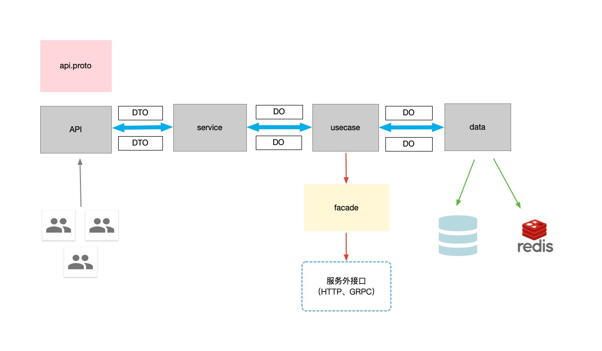

# 工程目录设计

## 开发环境
- go version: >= go1.16  
- IDE: 建议goland、vscode

## 包管理
`Go Modules`

## 工程目录结构

### 一级目录
```
├── api
├── cmd
├── internal
├── pkg
├── configs
├── Dockerfile
├── go.mod
├── go.sum
├── README.md
```

### cmd目录
- 项目APP的入口，启动服务的地方。
- 每个应用程序的目录名应该与你想要的可执行文件的名称相匹配。

### API层
- HTTP/GRPC server interface定义的地方，也包含作为数据载体的DTO（Data Transfer Object）的定义（由proto定义自动生成）。
- 数据载体的简单校验以及返回数据的渲染。 
  
### docs
- 文档使用说明放置的地方。

### internal
- 私有目录，当别的库import本项目的时候，internal对其不可见。（Go 1.4以上支持）。
- 我们一般用来编写服务的业务代码。 

### pkg
- 外部应用程序可以使用的库代码。
- 放置一些项目内或者跨应用的共同可用的代码。

## cmd层
```
├── cmd
│   └── app
│       └── main.go
```
- 目录内设计应该是/cmd/你的应用名称/main.go, main.go是你项目服务启动的地方。

## api层
```
├── api
│   └── user
│       └── v1
│           ├── errors.pb.go
│           ├── errors.proto
│           ├── user.pb.go
│           ├── user.proto
│           ├── user_grpc.pb.go
│           └── user_http.pb.go
```
- api层下的目录设计规范应该是，/api/你的应用名称/版本号。  
- 这里通常会包含两个proto文件，一个是xxx.api.proto，是用来定义服务的。一个是errors.proto，来定义服务的错误状态码的。
- 我们会通过CI/CD的方式，将这层目录下的proto上传到koiosapis公共仓库，并带上应用名称以及版本号目录，（也可使用git做版本管理控制）。当外部服务想要引用本服务，可以直接依赖koiosapis仓库，而不是我们的项目。

## internal层
```
├── internal
│   ├── data
│   │   ├── data.go
│   │   ├── model
│   │   │   ├── migration.go
│   │   │   └── user.go
│   │   └── user.go
│   ├── domain
│   │   └── user.go
│   ├── facade
│   │   └── facade.go
│   ├── service
│   │   ├── service.go
│   │   └── user.go
│   └── usecase
│       ├── usecase.go
│       └── user.go
```
- service目录
  - 实现api层定义的服务接口
  - 消息载体DTO到领域模型DO的转化
  - 编排usecase层。在这一层，我们应该可以清楚的看到处理的业务逻辑线，但是不应看不到具体业务逻辑的实现。业务逻辑实现应该由usecase实现。

- usecase目录
  - 负责具体业务的实现
  - 一般会依赖两个对象。依赖注入data层的repo接口对象，以及facade层的外部GRPC/HTTP接口对象。

- facade目录
  - 防腐层目录。为了防止引入外部API而对项目的腐蚀破坏。
  - 重新定义项目外接口服务（比如需要依赖的GRPC服务或者HTTP服务。），必须是以接口的方式暴露。

- data目录
  - 定义repo接口，以及做repo层接口的实现。
  - repo接口的实现，会注入一个Data对象（直接与db/cache打交道），所以repo接口可以间接的去操作db/cache。
  - Data对象管理数据持久化对象PO（Persistent Object），并且管理着关系型数据库的migration。

- domain目录
  - 定义领域模型DO（Domain Objcet），DO是关于业务实体的抽象，并且包含一些公用的业务方法。

## 数据流转图


## 数据流转的几个对象
- DTO（Data Transfer Objcet）数据传输对象。HTTP/GRPC消息的载体。
- DO（Domain Objcet）领域模型。承载业务抽象出来的对象，并包含自身的一些业务逻辑。
- PO（Persistent Objcet）持久化对象。数据库建模对象。仅仅包含表字段的定义以及主键、外键、索引等表相关的定义。


## `References`

- https://github.com/go-kratos/kratos-layout
- https://github.com/go-kratos/beer-shop
- https://github.com/bxcodec/go-clean-arch
- https://github.com/eminetto/clean-architecture-go